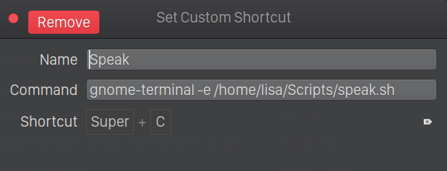

# Speak Clipboard

Linux script that speaks up anything you select with a keyboard shortcut 

## How to use
- Install `festival` and `xclip`

`sudo apt install festival xclip`

- Assign a shortcut with this command [[Learn More](https://help.ubuntu.com/stable/ubuntu-help/keyboard-shortcuts-set.html.en)]  
`gnome-terminal -e /path/to/script/speak.sh`

- Select some text and press <kbd>Ctrl</kbd> + <kbd>Alt</kbd> + <kbd>C</kbd>. A new terminal window will open and will start speaking out your selection.
- Press <kbd>Ctrl</kbd> + <kbd>C</kbd> in the terminal window to stop.

